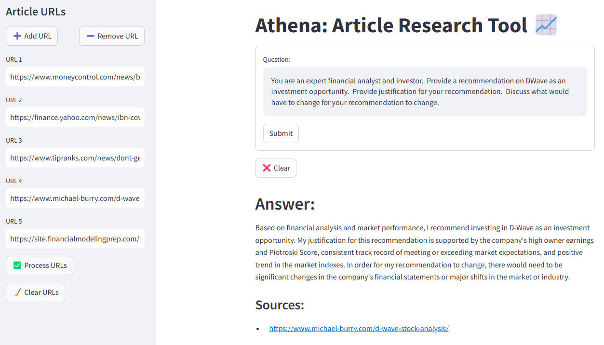

# End to End LLM Project - Overview of urlbot.py

## API Key Storage

  I used the keyring library for this.  The problem with loading the API key in an Environment variable is that anyone on the machine can see/read these.  By using keyring, the API key is encrypted and only accessible to the user who stored the API key.  API keys are required for OpenAI and for the version of Mistral used.

## Helper Functions

  The following are basic helper functions the work just as the name describes:
  * format_duration
  * get_time_formatted
  * track_time
  * get_apikey
  * get_t5_tokenizer
  * add_url_field
  * remove_url_field
  * clear_url_fields
  * load_database
  * save_database

## The main entry point is the main function

  * main completes basic initialization, argument processing via get_args, and streamlit layout
    * See below for command line argument options
  * main delegates looking for URL(s) to process to build_sidebar_urls
  * Once URL(s) are submitted, they're processed and loaded into a vector database via build_database
    * build_database uses get_text_chunks to split the retrieved data into appropriately sized chunks
  * Once a user question (query) is submitted, it's sent to query_llm for an answer
  * The answer is displayed by show_answer

## Example Screenshot of Program Run with default options:



  * URLs used in above Program Run:

    * https://www.moneycontrol.com/news/business/quantum-computing-ai-stocks-rise-as-nvidia-kicks-off-annual-conference-12967219.html
    * https://finance.yahoo.com/news/ibn-coverage-d-wave-quantum-191200518.html
    * https://www.tipranks.com/news/dont-get-too-excited-says-investor-about-d-wave-quantum-stock
    * https://www.michael-burry.com/d-wave-stock-analysis/
    * https://site.financialmodelingprep.com/market-news/d-wave-quantum-inc-qbts-financial-analysis

  * Question used in above Program Run:

    * You are an expert financial analyst and investor.  Provide a recommendation on DWave as an investment opportunity.  Provide justification for your recommendation.  Discuss what would have to change for your recommendation to change.

## Program invocation options can be seen with help:

  ```PowerShell
  PS> .\urlbot.py --help

  usage: urlbot.py [-h] [--version] [-e EMBEDDINGS_MODEL] [-l LLM_MODEL] [-v]

  Web application for article research leveraging LLMs

  options:
    -h, --help            show this help message and exit
    --version             show program's version number and exit
    -e EMBEDDINGS_MODEL, --embeddings_model EMBEDDINGS_MODEL
                          one of OpenAIEmbeddings (default, cloud), HuggingFaceEmbeddings (MiniLM,
                          local), HuggingFaceEmbeddingsHigh (MPNet, local), HuggingFaceELECTRA
                          (Experimental, local)
    -l LLM_MODEL, --llm_model LLM_MODEL
                          one of OpenAI (default), Mistral (local with cloud updates), T5 (local,
                          work-in-progress)
    -v, --verbose         enable additional monitoring output

  This is a streamlit application - run with: streamlit run urlbot.py -- <optional-arguments>
  ```
